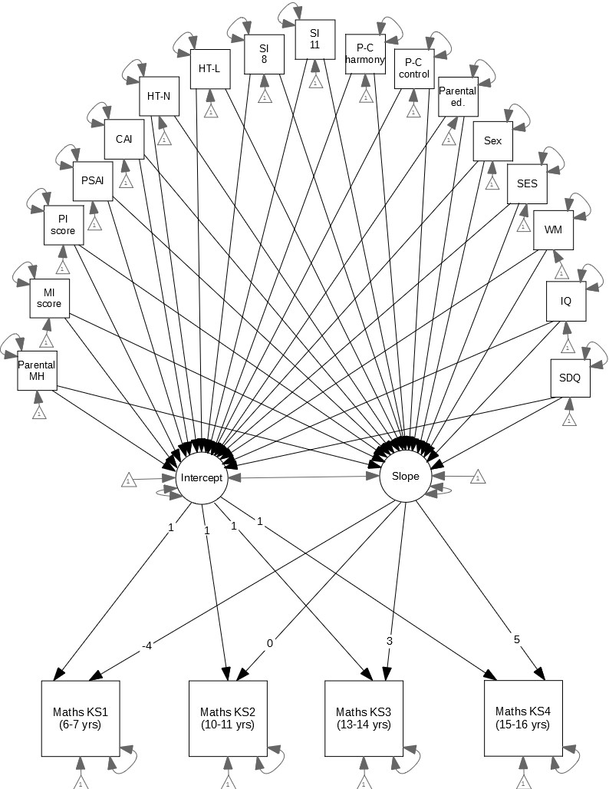
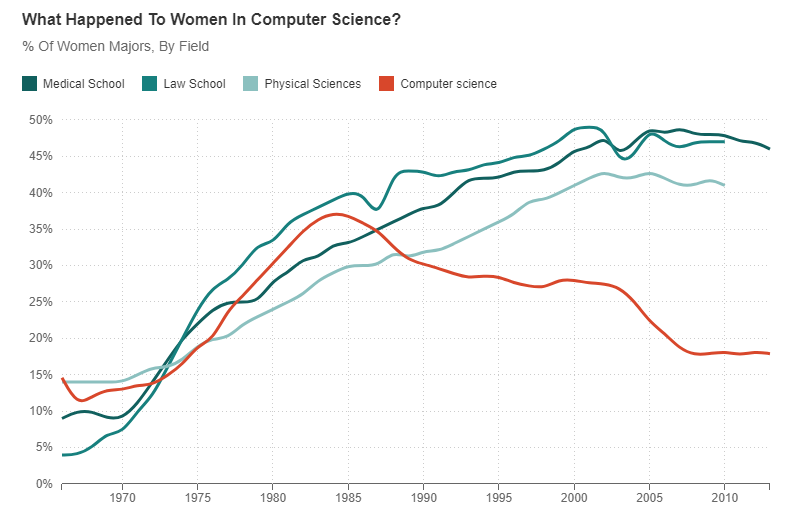

```{r, echo=FALSE, eval = F}

xaringanExtra::use_logo("../img/logo.png", width = "30px", height = "30px", link_url = "https://desupervision.netlify.app/")

```

```{r setup, include=FALSE}
library(xaringanthemer)
library(xaringanExtra)
library(tidyverse)
library(broom)
library(papaja)
library(ggcats)
library(ggimage)


options(htmltools.dir.version = FALSE)
xaringanExtra::use_panelset()


```

```{r xaringan-themer, include=FALSE, warning=FALSE}

style_mono_light(
  base_color = "#23395b"
)

```


# Session Overview

#### Part 1: Course Overview

- Introduction to fundRmentals


#### Part 2: Showcase

- The R-cult: why R is `r emo::ji("star")`*magical*`r emo::ji("star")` 


#### Part 3: Getting StaRted

- Next steps 

- Tips for success


???

- Welcome to fundrmentals

- intro self & R

- learning for 4 years, initially found it quite scary and not enjoyable, but then the more i understood the cooler it became and now i genuinely love it, not a day where i dont use it

- im super excited to help you get started with learning R, & i promise i'll try to make the process as painless & enjoyable as possible 

- for today's session its gona be a lil different to how these will run normally

- its split into 3 relatively short sections to just give you an overview of how the course will work, what the sessions will look like, & where you can find materials, i'm gonna show you some of the really cool things you can do in R to hopefully demonstrate that R can be fun, and incredibly useful and valuable to the work that you do, and also that its not all super difficult, and then i'll tell you about the first tutorial and how you can get started ready for the next session in a week

- if you have any questions pop them into the chat, or we can discuss anything that comes up at the end

---


class: inverse, middle, center

# Part 1: Course Overview


---


# Introduction to fundRmentals

.pull-left[

#### Course Structure

- Weekly tutorials to do in your own time 

- Weekly 'HappyHouR' practical sessions 

<br>

#### Course Aims 

- Gain solid understanding of the 'fund**R**mentals' 

  + Feel confident supervising project students using R 

  + Feel inspiRed to use R/RStudio for your own projects  

]


.pull-right[

#### FundRmentals [Webpage:](https://fundrmentals.netlify.app/)

<iframe id="inlineFrameExample"
    title="Inline Frame Example"
    height="350"
    width="500"
    src="https://fundrmentals.netlify.app/">
</iframe>

]


???

- the course is structured so that you have weekly tutorials to complete in your own time, you can do these alone or team up with someone else and work through them together, its entirely up to you

- then we'll also have a practical session together, a happy hour if you will, i promise you wont need alcohol to get through it, in these sessions, we'll practice some tasks from the tutorial, consolidate everything you've learned from them in more interactive sessions

- just a way that you have a lil community of learnRs & ur not by ursefl, its quite nice to complain to others about anything that went wrong or you found confusing, or get excited about any cool things you've done or the things that have just gone well, it will also give me the opportunity to go anything that you found unclear in the tutorial and answer any questions that you have, & is also a way to keep up with doing stuff in R regularly

- so these more interactive sessions will start properly from next week at XXXX time for an hour, atm everything is on zoom, but i'll continue to review what works best and what everyone prefers

- then hopefully by the end of the course, you'll have a solid understanding of the fundrmentals, im sorry already for all the R puns but i cant help myself, it's also really important to me that you feel confident and comfortable supervising project students, and i'd love for you to also feel inspired and interested in using R for your own work

- to make organisation a little easier, i've hosted all the materials and information you need on a website, i sent the link in the email for this session so you might have had a look already, but i wanted to show you all a quick little tour now too

- tour of website


---


class: inverse, middle, center

# Part 2: Showcase

???

any questions so far?

the next part of the session today is my attempt at showing you how cool R is, and that it isnt as scary as you might think

---


# The R-cult: why R is `r emo::ji("star")`*magical*`r emo::ji("star")` 


- Makes complicated things easy to do

- Super efficient

- Collaboration

- Reproducibility 

- Visualisations

- Modelling

- Reporting

- Presenting

- & *sooo* many other cool things!! 


???

- there are so many pros to learning R, im gonna talk you through some of them, and show you some examples too,

- R is really useful because it makes hard things easy - R can do lots of complex things that wouldnt be possible in other software, can do really complex stuff with little effort

super efficient - can just copy and paste code, from my own experience i had 4 very complicated models in my phd, but once i'd written the first, i could just copy and paste the code so that the other 3 took literally seconds to do, having the ability to do all your analysis again with the click of 1 button is such a time saver, its also great for dealing with reviewers when writing papers, for me i submitted a paper with some longitudinal variables, the reviewer suggested using a different timepoint for one of them, in spss i would have had to re run the entire analysis again, but with R i was able to change 2 letters of a variable name and i could just press run and it was done

great for collaboration & reproducibility - you can share your whole project with other people using github, all work on the code, or writing etc., it also makes reproducing your work really easy, anyone with your code can see what you've done step by step, and if they have ur data they can reproduce it entirely, especially with the replication crisis we need to be more transparent about how we've cleaned and analysed our data and using R is one of the best ways that we can do that, sharing code of the analyses is also a requirement of many open access journals so you'd be keeping up with wider changes within psychology by learning R 

one of the most amazing things about R is that the visualisations you can create are pretty much unlimited, the packages for creating plots of your data are fantastic & have such a huge range of functions, im gona show you some of them in a minute to prove this

models are really easy to do in R and even really complex models are relatively straightforward, also a lot of stuff you wouldnt be able to do with other software you can do in R, i'm gonna show you a couple examples of the code for some models just so you can see how easy it is, and that its not so bad after all

presenting and reporting with R really are my favourite things, you can create different types of documents with your analyses and your writeup in one doc, theres packages where you can write a paper automatically in apa style with little effort, theres other packages that conform to the style of specific journals, and there's just some really cool things you can do with it, and im excited to show you some of them


---


# A *very* simple regression

- 1 line of code, much quicker than clicking in SPSS:

```{r, eval = F}

lm(outcome ~ predictor, data = data)

```

???

so firstly i wana start with a very simple, simple regression, with one predictor in this model, and to do this in R, you can use this very short line of code here, it follows the structure where you specify you want to use the lm function which is function for linear models, then you'd give the name of your outcome, the name of your predictor, and what the data is called, and it will fit your model and print out the main results for you when u run it, its literally so straightforward, you could have written this out before you clicked through spss menus

--

<br>

### *"But Dan, what if I have 10 predictors?"*

- Still just 1 line of code...

```{r, eval = F}

lm(outcome ~ predictor_1 + predictor_2 + predictor_3 + predictor_4 + predictor_5 + predictor_6 +
     predictor_7 + predictor_8 + predictor_9 + predictor_10, data = data)

```


???

but dan, what if i have 10 predictors? i hear you say...

its still just one line of code, this time we just have more variable names for our predictors, we just list them with the + sign, and thats our model fitted to our data, you really could have 100 variables and it would still just be this one line of code that you'd need to use, so even a multiple regression with loads n loads of predictors its still nice n easy,

but not all models have nice, continuous variables right...

---


# A *very* simple regression

- 1 line of code, much quicker than clicking in SPSS:

```{r, eval = F}

lm(outcome ~ predictor, data = data)

```

<br>

### *"But Dan, what if I have a factorial design?"*

- Still just 1 line of code...

```{r, eval = F}

lm(outcome ~ predictor_1*predictor_2, data = data)

```

???

so what if you have a factorial design? surely thats more complicated right...

to fit the model, its still just one line of code, this time we have two categorical predictors and this line would fit the model and look at the main effects of our predictors and any interactions with such a short line of code which follows the above where we specify our outcome, and our predictors, just this time we're mulitiplying them, not adding

with R you can fit very complex models & analyses with very little code and effort, like i said earlier it makes the difficult stuff easy, and it can be surprisingly straightforward, it might not look straightforward to you right now, because its likely completely unfamiliar, but i promise it becomes second nature after a lil while


i can almost guarantee that you could do your analyses in R before spss even fully opens


---


# A *very* simple regression

- 1 line of code, much quicker than clicking in SPSS:

```{r, eval = F}

lm(outcome ~ predictor, data = data)

```

<br>

### *"But Dan, what if I have a stupidly complex model?"*

???

i keep mentioning complex models and how R can do anything you want it to, so lets actually take a look at an example..


---


# A Gross Latent Growth [Model](../img/parmodel.jpg)

.panelset[


.panel[.panel-name[

## Model

]


```{r, echo = F, fig.align='center', out.width="28%"}



```

.center[
.teeeny[
[Evans & Field, 2020](https://royalsocietypublishing.org/doi/10.1098/rsos.200422)
]
]
]

.panel[.panel-name[

# Code

]

- Just 5 lines of code for this monstrosity: 

.teeny[

```{r, eval = F}

model <- "i =~ 1*sat140 + 1*ks2_mat + 1*ks3_mat + 1*ks4_maths
s =~ -4*sat140 + 0*ks2_mat + 3*ks3_mat + 5*ks4_maths

i ~ sex + int_sdq_11 + iq_cent + wm_cent + ses_cent + cse_voc + cse_olevel + cse_alevel + cse_degree + par_mh_fa + mum_home_int + part_home_int + cai_cent + psai_cent +
home_teach_1_al + home_teach_1_nu + schl_supp_sa + schl_supp_se + eas_harmony + eas_control

s ~ sex + int_sdq_11 + iq_cent + wm_cent + ses_cent + cse_voc + cse_olevel + cse_alevel + cse_degree + par_mh_fa + mum_home_int + part_home_int + cai_cent + psai_cent +
home_teach_1_al + home_teach_1_nu + schl_supp_sa + schl_supp_se + eas_harmony + eas_control"

growth(model, data = data, estimator = "MLR")

```

]
]
]


???

so this is a latent growth model, i've called it the gross latent growth model because it is disgusting

im gonna open this up a bit bigger for you to see better just how horrible it is, this is an actual model from my phd, it has 17 predictors around parental stuff & the home environment, and i was looking at how well they predict maths attainment trajectories, so for the outcome measures, i have four maths attainment variables, which fed into the estimates of the intercept and the slope of attainment over time, probably doesnt make much sense but what im tryna show is that theres a whole lot going on, 17 predictors 4 outcomes which then make up two measures of the trajectory

im gonna show you the code for this model in a second, but i want you to keep in ur mind what this looks like conceptually, and how little code was actually needed for it


for this model, its just one line of code! no its 5 lines of code so a little bit more than what we looked at before, BUT considering the complexity of the model, its still really straight forward

the first two lines define the model where we give the outcome measures, the second two lines define the predictors for our model, if we didnt have 17 of them, these two lines would be shorter

and then the final line just puts that together where we have the model that we've just specific, and the data to use

i really want you to see that even the really complex stuff isnt so bad, hopefully i havent done the opposite and scared you away 

incase i did, im gona show you some pretty plots made in R to make you feel better

---


# Data Viz: A Pretty Plain Scatterplot

.center[
.middle[

```{r, echo = F, message=FALSE, warning=FALSE}

# Scatter plot
ggplot(palmerpenguins::penguins, aes(x = flipper_length_mm, y = body_mass_g)) + geom_point(colour = "black") + theme_apa() + labs(x = "Flipper Length (mm)", y = "Body Mass (g)")

```


]]


???

i said in the beginning that one of the really cool things about R is the ability to visualise data in pretty much unlimited ways, you can do so many things with different pakcages and functions that you can create anything that your imagination and data will allows, you can have manny different types of plots, different colours, you can add extra labels, titles, captions, themes literally anything, so for publications you could have very plain scatter plot like this one, which was made with an apa theme, but uno, maybe thats a lil bit boring, maybe you want something more colourful for a lecture or a presentation


---

# Data Viz: Rainbow Box Plot

.center[
.middle[


```{r, echo = F, warning=F, message=F}


set.seed(1410)
dsmall <- diamonds[sample(nrow(diamonds), 1000), ]

p3 <- ggplot(dsmall, aes(color, price/carat, fill=color)) + geom_boxplot() + theme_apa()
p3

```


]]

???


so we could have a rainbow box plot of diamond colour and price, none of these plots make any real sense, its all just random data i found, so you can have preselcted colours, or you can specify the exact colour that you want to use


---

# Data Viz: Rainbow Jitter Plot

.center[
.middle[

```{r, echo = F, warning=F, message=F}


p1 <- ggplot(dsmall, aes(color, price/carat)) + 
            geom_jitter(alpha = I(1 / 2), aes(color=color))+ theme_apa()
p1

```

]]


???

i said there were multiple types of plots you could create, and this is an example of that, the only difference in the code used is one word, it displays the same information as the previous graph, but in a slightly different way by changing the function, you can completely customise how these look as well, i remember editing plots in spss and it being a painful experience, but with this you can really do whatever you want


<!--

# Data Viz: Rainbow Circular Barchart

.center[
.middle[

```{r, message = F, echo = F, warning = F}


diamonds2plot <- diamonds %>%
  group_by(cut, color) %>%
  summarise(price = mean(price)) %>%
  arrange(color, price) %>%
  ungroup() %>%
  mutate(id = row_number(),
         angle = 90 - 360 * (id - 0.5) / n())

diamonds2plot  %>%
  ggplot(aes(factor(id), price, fill = color, group = cut, label = cut)) +
  geom_bar(stat = 'identity', position = 'dodge') +
  geom_text(hjust = 0, angle = diamonds2plot$angle, alpha = .5) +
  coord_polar() +
  ylim(-3000, 7000) +
  theme_void() 

```
]]

-->

---


# Data Viz: Mario Kart Rainbow Road 

.center[
.middle[

```{r, echo = F, message=F, warning=F}


managers_energy = read.csv("../docs/managers_energy_data.csv")
simulation = read.csv("../docs/simulation.csv")

# basic plot of empirical data
manager_plot =  ggplot() +
                geom_point( data = managers_energy, 
                aes(x = energy_pc, y = managers_employment_share)) 


# smaller point size
manager_plot = ggplot() +
                geom_point( data = managers_energy, 
                size = 0.8,
                aes(x = energy_pc, y = managers_employment_share)) 


# add log scales
manager_plot =  manager_plot +
                scale_x_log10() +
                scale_y_log10() 


# better axis breaks
manager_plot = manager_plot + 
  scale_x_log10(breaks = c(5,10,20,50,100,200,500,1000)) +
  scale_y_log10(breaks = c(0.1,0.2,0.5,1,2,5,10,20)) 


# descriptive labels
manager_plot = manager_plot +
  labs(x = "Energy use per capita (GJ)", 
       y = "Managers (% of Total Employment)" ) 


# add simulation data
manager_plot = ggplot() +
  geom_point(data = simulation, 
             size = 0.1,
             alpha = 0.3,
             aes(x = energy_pc, 
                 y = managers_employment_share, 
                 color = span_of_control)
             ) +
  geom_point(data = managers_energy, 
             size = 0.8,
             aes(x = energy_pc, 
                 y = managers_employment_share)
             ) +
  scale_x_log10(breaks = c(5,10,20,50,100,200,500,1000)) +
  scale_y_log10(breaks = c(0.1,0.2,0.5,1,2,5,10,20)) +
  labs(x = "Energy use per capita (GJ)", 
       y = "Managers (% of Total Employment)") 


# limit plot range
manager_plot = manager_plot +
  coord_cartesian(xlim = c(5,1000), ylim = c(0.1,30)) 


# descriptive color legend label 
manager_plot = manager_plot + 
  labs(color = "Span of Control")


# line break in legend label
manager_plot = manager_plot + 
  labs(color = "Span of\nControl")


# rainbow colors for span of control
manager_plot = manager_plot +
  scale_color_gradientn(colours = rainbow(8))


# reverse color legend
manager_plot = manager_plot +
  scale_color_gradientn(colours = rainbow(8), 
                        guide = guide_colourbar(reverse = T))


# black and white theme
manager_plot = manager_plot + theme_bw()


# change font to Times
manager_plot = manager_plot + 
  theme(text=element_text(size = 10, family="Times"))


# all code
manager_plot = ggplot() +
  geom_point(data = simulation, 
             size = 0.1,
             alpha = 0.3,
             aes(x = energy_pc, 
                 y = managers_employment_share, 
                 color = span_of_control)
  ) +
  geom_point(data = managers_energy, 
             size = 0.8,
             aes(x = energy_pc, 
                 y = managers_employment_share)
  ) +
  scale_x_log10(breaks = c(5,10,20,50,100,200,500,1000)) +
  scale_y_log10(breaks = c(0.1,0.2,0.5,1,2,5,10,20)) +
  labs(x = "Energy use per capita (GJ)", 
       y =  "Managers (% of Total Employment)",
       color = "Span of \nControl") +
  coord_cartesian(xlim = c(5,1000), ylim = c(0.1,30)) +
  scale_color_gradientn(colours = rainbow(8), 
                        guide=guide_colourbar(reverse = T) ) +
  theme_bw() +
  theme(text=element_text(size = 10, family="Times"))


# all code with custom theme
manager_plot = ggplot() +
  geom_point(data = simulation, 
             size = 0.1,
             alpha = 0.3,
             aes(x = energy_pc, 
                 y = managers_employment_share, 
                 color = span_of_control)
  ) +
  geom_point(data = managers_energy, 
             size = 0.8,
             aes(x = energy_pc, 
                 y = managers_employment_share)
  ) +
  scale_x_log10(breaks = c(5,10,20,50,100,200,500,1000)) +
  scale_y_log10(breaks = c(0.1,0.2,0.5,1,2,5,10,20)) +
  labs(x = "Shells Thrown", 
       y =  "Laps",
       color = "Lane") +
  coord_cartesian(xlim = c(5,1000), ylim = c(0.1,30)) +
  scale_color_gradientn(colours = rainbow(8), 
                        guide=guide_colourbar(reverse = T) ) +
  theme_bw() +
  theme(panel.grid.major = element_blank(), 
      panel.grid.minor = element_blank(), 
      plot.title = element_text(face="bold", size = rel(1), hjust = 0.5),
      axis.line = element_line(color = "black"), 
      axis.title.x = element_text(vjust= 0, size=rel(0.9)),
      axis.title.y = element_text(vjust= 1.1, size=rel(0.9)),
      axis.text.x = element_text(margin=margin(5,5,0,0,"pt")),
      axis.text.y = element_text(margin=margin(3,5,0,3,"pt")),
      axis.ticks.length = unit(-0.7, "mm"),
      text=element_text(size = 10, family="Times")) 


manager_plot + theme_apa()


```


]]


???

& if that isnt enough rainbow for you, you can create something that looks like the the mario kart rainbow road to me

i did say that these packages and functions are essentially unlimited

---


# Data Viz: sCATterplot

.center[
.middle[

```{r, echo = F, message=FALSE, warning=FALSE}

# Scatter plot
ggplot(iris, aes(Petal.Length, Petal.Width)) +
 geom_cat(cat = "lil_bub", size = 2) +theme_apa() + labs(x = "Catnip Consumed", y = "Happiness")

```


]]


???


i did say that these packages and functions are essentially unlimited, so here i propose the sCATterplot

---


# Data Viz: Dan<sup>2</sup>


.center[
.middle[


```{r, echo = F, warning=F, message=F}

d <- data.frame(x = iris$Sepal.Length,
                y = iris$Sepal.Width,
                image = "../img/mem.png"
                ) %>% sample_n(., 90)

ggplot(d, aes(x, y)) + geom_image(aes(image=image), size=.1) + theme_apa() + labs(x = "Dan", y = "Dan")


```

]]

???

or you cud even create a plot with your own images if you wish, this was really easy to do as well whicH probably it shouldnt be because now i might just do it for everything

these are really stupid examples, but shows the range of these packages in R and what you can do, not always for the best, i cant imagine that if u included a catterplot in your paper any editors wud accept it 


---


# RMarkdown

.pull-left[

- Combine code (analyses, plots etc.) & write-up in one document 

- Create a nicely formatted word doc/html/pdf & more

- Super useful for writing papers, dissertations & theses

- Additional packages (`papaja` & `rticles`) for apa style/journal formatting


]

.pull-right[

```{r paper, echo=FALSE, out.width = '70%', fig.align='center'}
knitr::include_graphics("../img/papajagif.gif")
```

]


???

now you've created all your amazing plots, you probably need somewhere to put them, you can export them as images, or another, better method, is to include your code of your analyses and tables or plots in the same document as you main writeup

we can do this with a package called rmarkdown, I love it so much, its really one of my fave things, its something i work with all the time, i pretty much never use word anymore because i use this instead

what it is is a template you can use, where you can have chunks of code and then any normal body text within one document, you press a button to render it this becomes a pretty, nicely formatted document, i've written all my papers this way & wrote my thesis with it

theres additional templates you can use that conform to apa style or specific journal formats

this is an example of the apa version looks like at the end


its really useful because its reproducible, anyone with this document and your data can replicate what you've done, and they can clearly see what youve done, its really good if if there are any changes with your data, whether you end up collecting more, or excluding any participants later on, for whatever reason, you can just re run it and everything updates, you wouldnt have to redo everything, imagine graphs, you dont have to keep switching between lots of differnet programs and different files, keeps u organised with everythign in one placee, and its super versatile, you can render to different types of documents

its even more useful when written with something called inline code...

---

# Inline Code

- Allows you to include code within the main text of your document 

- Can be used with test results, values from tables etc.

- Any values will be automatically updated when you render the file 

- Incredibly useful & efficient

- Helps you avoid tYpos & rounding erroRs

<br>

.center[

**The final sample consisted of `` `r knitr::inline_expr("nrow(data)")` `` participants.**


```{r, echo = F, fig.align='center', out.width="5%"}


```


**The final sample consisted of 500 participants.**


]


???

inline code is where we can embed lil lines of code within the body text of a document

so we can use functions, or pull out values from any test results, or tables etc.,

and then if there are any changes to those values i.e., collecting more data, then they will automatically update

great for paper revisions, no need to rewrite everything, if u need to re run your analysis after some reviewer suggestions for example, your writeup of your results will update automatically wherever you've used inline code to report them

never  really understood it for a long time, but myt fave thing now, such a gamechanger, it will absolutely transform how you work if u publish a lot or ever deal with demanding reviewers, 


<!--

# SisteRs are doin' it for themselves (*& others*)

.pull-left[

- Widening gender gap in coding skills ([npr, 2014](https://www.npr.org/sections/money/2014/10/21/357629765/when-women-stopped-coding); [OECD, 2015](https://www.oecd-ilibrary.org/education/the-abc-of-gender-equality-in-education_9789264229945-en))

- Psychology @ Sussex is predominantly made up of female students & is an entry into STEM fields where girls are underrepresented 

- By learning how to code ourselves, we can help reduce the skills gender gap by being role models/supporting students' learning 
]


.pull-right[

<a href="https://www.npr.org/sections/money/2014/10/21/357629765/when-women-stopped-coding">

```{r, echo = F}



```

</a>

]

???

women were the original coders, but are less likely to work in computing roles now, there's been a few different initatives to get girls more involved in coding but they still remain underrepresented, its no surprise that psychology at sussex attracts/recruits mostly female students, so by being able to support their learning, or being role models for them, we can help reduce the skills gender gap, 

-->

---


class: center, middle

# You can create beautiful [slides](https://github.com/yihui/xaringan) like these... 


```{r, echo = F}

knitr::include_graphics("../img/office.gif")

```


???

you can also do more cool stuff in R, these slides were written in R, with rmarkdown, i dont use powerpoint anymore


---


class: center, middle

# You can create super cool [websites...](https://rstudio.github.io/distill/) `r emo::ji("wink")`


<iframe id="inlineFrameExample"
    title="Inline Frame Example"
    height="350"
    width="1000"
    src="https://fundrmentals.netlify.app/">
</iframe>


???

the fundrmentals website was also created in R 

---

class: inverse, middle, center

# Part 3: Getting StaRted


???

hopefully now i've convinced you that R is worthwhile learning, i know when i was learning it for the first time that i just felt abit defeated by how different and complicated everything seemed compared to spss, but now i wud never ever go back to spss

i promise once you get past that initial fear, and unfamiliarity, it becomes much easier, and more interesting, more fun, and generally just a really useful thing to know for your own work


---

# Next Steps

#### Complete the [tutorial](http://milton-the-cat.rocks/learnr/r/r_getting_started/) before our first HappyHouR next week, which covers: 

  + How to install R & RStudio (see the [Week 01 webpage](https://fundrmentals.netlify.app/week_01.html) for download links to the software)
  + A tour of RStudio
  + Working in RStudio
  + Installing & loading packages
  + RMarkdown


#### Tips for Success

  + Practice as often as you can
  + Be kind to yourself - it feels really slow & confusing when you first start
  + Celebrate the little wins
  + Ask lots of questions, often someone else explaining it slightly different makes everything click
  + There's a huge online community of R users, for any problems/errors you're having the solution can usually be found quite easily by searching
  + Google is your best friend 


???

ok so now for the next steps before our first happy hour next week, is that you need to download r and rstudio if u havent already, in the tutorial for next week andy goes through what they actually are, and how to download them, but ive also given some extra information on the website with the download links, the rest of the tutorial covers a tour of rstudio, which is the main program we'll use, so R is the programming language, but rstudio is the interface that we'll work with, there will also be a tour of rstudio, & how to install & load packages, and some info about rmarkdown

so you should aim to work thru these sections of the tutorial before we meet next week, if u have any problems just let me know, u can email me or post on the padlet with anything that comes up or any questions u want me to answer next week

i also just want to finish with some tips for success

r can be tricky, it can feel very weird to begin with, everything seems really unfamiliar so thats why you should try to use it as often as you can, even if its just for a few minutes, it is a language after all, and its easy to forget stuff if you leave it a while

be kind to urself, u might not get something right away and thats ok, it can feel like everything is confusing and like ur not progressing very quickly, but everyone has this point where stuff suddenly just makes sense and theres this steep updward curve in your knowledge n skills

ask lots of questtions, nothing is ever a stupid question, often u can hear the same person explain something 20 times and doenst make sense, but another person just explaining slightly differently can make everything click, so if anything is unclear pls let me try help

there is a huge huge community of r users online, so many resources, lots of forums, if u have an error or a problem or want to know how to do something, u can alsmot definitly find it on google, so dont be afraid to search it up

finally just stick with it, i never cud have imagined i wud be teaching R when i started learning it those few years ago, so if i can do it, u can do absolutely do it


QUESTIONS


