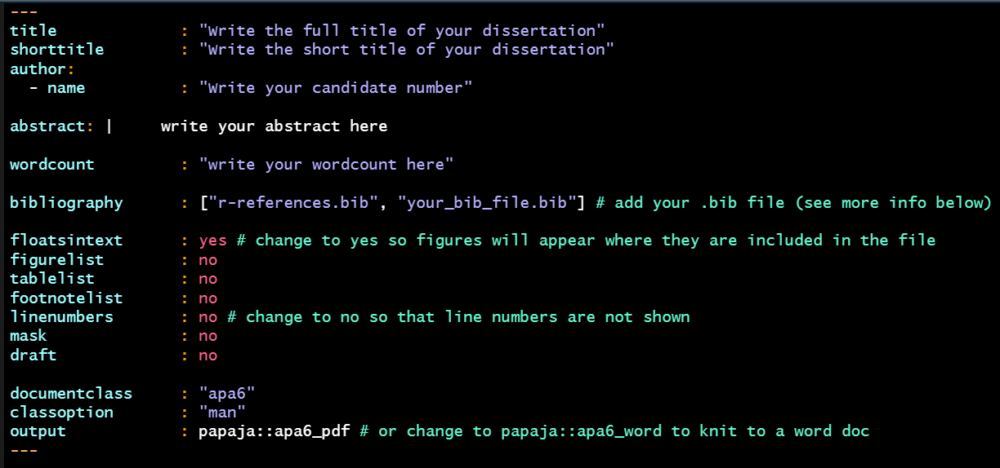
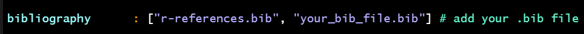
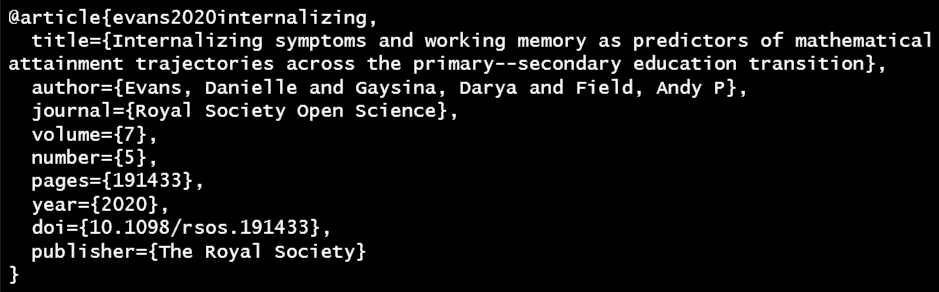
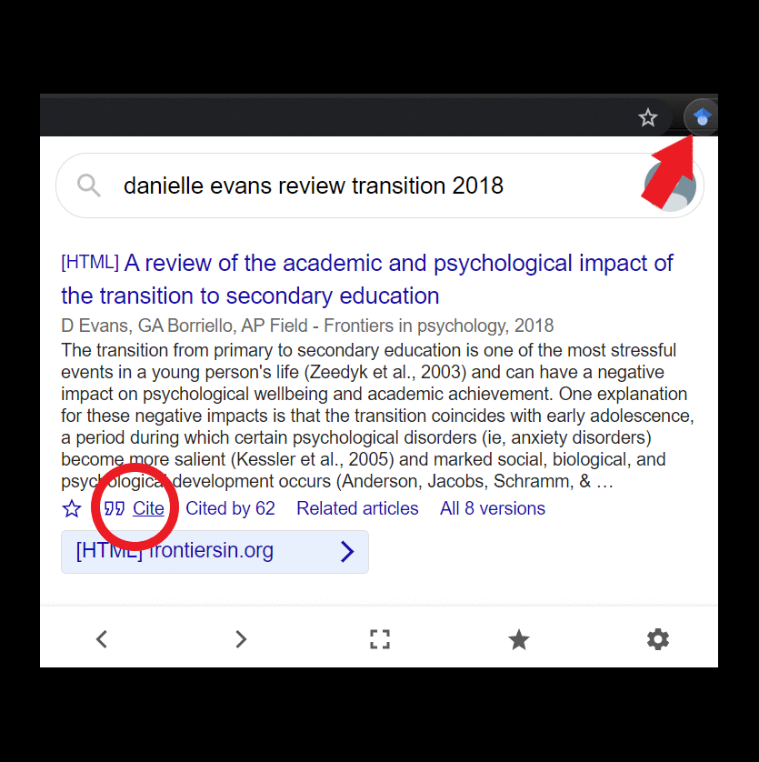
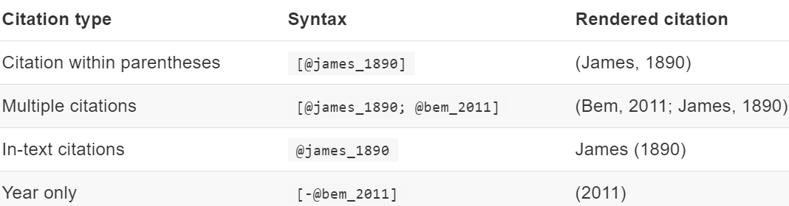
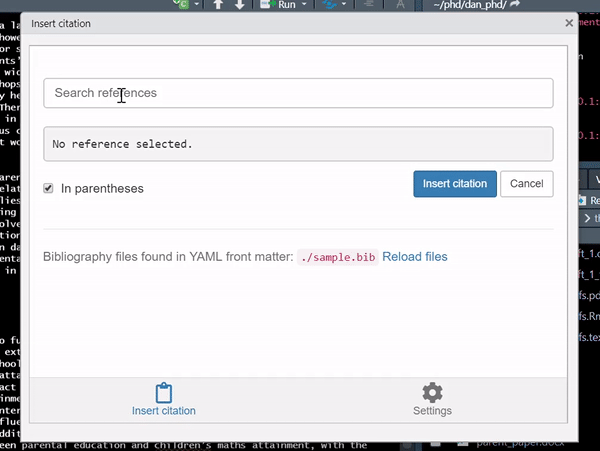

```{r setup, include=FALSE}
knitr::opts_chunk$set(echo = FALSE, eval = FALSE)
library(emo)
xaringanExtra::use_clipboard()
```

### Workflow

The best way to work within R is to create an R Project for each specific project you work on. This idea applies to your dissertation too where it's best to create an R Project solely for your dissertation. 


:::task

Create a dissertation R Project in a sensible location on your device 

:::


You should use this newly created R Project for all dissertation related files to keep everything all in one place and nicely organised. 

You should then aim to create the following folders: 

- data

- r_docs

- misc_docs

- references

Within these folders, `data` should contain any raw data, `r_docs` should contain any Rmds or R scripts, `misc_docs` (or just `docs` if you prefer) should contain any documents not created in RStudio such as ethics forms, and `references` should contain saved copies of articles you have read and will cite in your writeup, and .bib files (more on these [later..](#referencing-.bib-files)). You don't have to follow this workflow at all, but you might find it helpful to structure your files in this way so that things don't get muddled! 


:::task

Within the R Project you've just created, create 4 folders to contain your `data`, `r_docs`, `misc_docs`, and `references` (or use whichever names you prefer) 

:::

<br>

### Installing papaja

`papaja` is an [R package](http://frederikaust.com/papaja_man/) that contains an Rmd template for producing APA style reports. It's what I recommend to use when writing up your dissertation in RMarkdown to create a pretty report when you knit your document (it's also what I wrote my [PhD thesis](https://sro.sussex.ac.uk/id/eprint/94942/1/Evans%2C%20Danielle%20Nicole.pdf) with & is one of my fave packages, in close competition with the [BRRR package](https://github.com/brooke-watson/BRRR) - seriously, go check it out right now! `r emo::ji("sunglasses")`). 

With `papaja` you can knit your Rmd to a pdf or word document so you can use whichever format you prefer, and it's just a really nice way of creating reproducible analyses that are super pretty with your report automatically formatted in APA style - a total win-win! 

It's best to install `papaja` as soon as possible in the semester (ideally week 1) so that I can troubleshoot any problems early on. The following steps will guide you through the installation process.


#### Step 1: install a TeX distribution

LaTeX is needed when knitting from an Rmd to a pdf document. Installing a TeX distribution on your device is arguably the worst part of the installation process. For more info see the [installation details..](http://frederikaust.com/papaja_man/introduction.html#getting-started)

To install it in RStudio, you can run the following lines in the console: 

```{r, echo=TRUE, eval=FALSE}

if(!"tinytex" %in% rownames(installed.packages())) install.packages("tinytex")

```

```{r, echo=TRUE, eval=FALSE}

tinytex::install_tinytex()

```


#### Step 2: install papaja

Installing the `papaja` package is more straightforward, firstly we need to check that we have `devtools` installed (the first line below), and secondly we need to install `papaja` from github rather than from the cran (the second line). 

```{r, echo=TRUE, eval=FALSE}

if(!"devtools" %in% rownames(installed.packages())) install.packages("devtools")

```

```{r, echo=TRUE, eval=FALSE}

devtools::install_github("crsh/papaja")

```


:::task

Install `tinytex` and `papaja` using the code above!

:::

<br>

### Using `papaja` 

Once everything's installed, the Rmd template from the `papaja` package can be easily accessed through the main menu. To open the template go to File > New File > R Markdown... in the window that pops up, click on From Template > APA article (6th edition) > OK


:::task

Open the APA article template using the instructions above 

:::


This template is very similar to the standard Rmd that you're used to working with previously. The template still contains three main components: 

- The YAML for document metadata

- R Code Chunks for code

- Markdown for your main writeup


The main difference between this template and a normal Rmd is that the YAML just contains some additional options. 


:::task

Knit the document as it is to check it all works!

:::


After knitting, you should have an APA style article magically appear! `r emo::ji("star_struck")`


:::sol

Your dissertation should be submitted with the file name: cand_no_report

When creating the Rmd for your dissertation writeup, save it with this file name from the start to avoid any issues later on & remember to save it in the r_docs folder of your R Project as suggested in the [workflow](#workflow)

:::

<br>

### YAML Options

You might notice in the Rmd that there are quite a few extra YAML options we can set that will change various parts of the document. Some of these options are more useful/relevant than others so I've included the main ones you'll be using below, and the rest you can delete from the YAML.

```{r, echo=FALSE, eval=TRUE, out.width = '100%', fig.align='center'}



```

:::sol

To avoid more errors & to check your wordcount & spelling more accurately, I recommend knitting to a Word doc

This is easily changed in the final line of the YAML above!

:::


<br>

### Referencing & .bib files

To automatically reference articles/books/other sources in RMarkdown, the setup is slightly different to what you will have used previously. Instead, we use BibTeX references which we include within a .bib file that we specify in the YAML of our Rmd (see image above). There are many pros to using this approach in that you don't ever have to worry again about formatting your in-text citations to APA style, and that your reference list is automatically generated and formatted (amazing right?!)

These files can feel (& look) a little confusing to start with but I personally find it much better this way than what I did before and once you get the hang of it it's much quicker!

To create a .bib file it's super easy, just follow the steps below!  


:::task

In your dissertation R Project, open up your working directory by going to the Files Pane > More > Show Folder in New Window

:::

If you completed the task box above, your dissertation R Project folder should now open.


:::task

In this folder, open a new plain text document by right-click > New > Text Document & name it diss_references (or whatever you prefer)

Once created, rename the file to have a .bib extension rather than a .txt extension & you will have created your .bib file! 

Then move this file to the references folder of your R Project to keep with the [workflow](#workflow) 

:::

<br>

OK, so now we have created our .bib file, there are two things we need to do: 

1. Add this file path to the bibliography part of the YAML in our Rmd 

2. Add some references  

For step 1, it's nice and simple, we just need to include the file path like the example below: 


```{r, echo=FALSE, eval=TRUE, out.width = '100%', fig.align='center'}



```


:::task

Add the .bib file you just created to the YAML 

:::

<br>

Now we need to add some references to our .bib file! 

BibTeX references look like this: 

```{r, eval = TRUE, echo=FALSE, out.width = '100%'}



```

Where "article" is the type of the source, "evans2020internalizing" is the label, and the remaining fields refer to the different components of a bibliography item. The BibTeX references of articles are given on many journal webpages, but the easiest way to get them IMO is by using the Google Scholar Button for Chrome (see the steps below). 

```{r, eval = TRUE, echo=FALSE, out.width = '60%', fig.align='center'}

```


:::task

Search for a relevant article & copy/paste the entry to your .bib file (you can open the .bib file in RStudio)

:::


<br>

& finally we need to insert the references to the Rmd!

There are two ways of inserting references, you can do it manually by inputting the BibTeX label, or you can use the citr RStudio add-in which allows you to search for the reference from the .bib file. 

To insert them by hand, it's super straightforward, the table below (taken from the [papaja manual](http://frederikaust.com/papaja_man/writing.html#citations)) shows you how to include the reference label and what will be shown in the knitted file. 


```{r, eval = TRUE, echo=FALSE, out.width = '100%'}

```


<br>

Alternatively, you can use the citr addin to search for the references in your .bib file. Within RStudio, find the "Addins" menu underneath the Tools & Help buttons, citr can be accessed from there.


```{r, eval = TRUE, echo=FALSE, out.width = '70%', fig.align='center'}

```

<br>

:::sol

You will see a "References" section at the end of the papaja template, you don't need to edit this, just leave it as it is - everything is automatic!

:::

<br>

#### Referencing R Packages

You will see the below code in the papaja Rmd template. What this does is automatically include any packages you use within the references section. You don't need to edit this in anyway, just leave as it is and remember to cite the R packages you use for analysis in the method/results section of your report. 

```{r, echo = TRUE}
library("papaja")
r_refs("r-references.bib")
```


<br>

### Inserting Student Support Stickers in R

Including a student support sticker when writing your dissertation in R is super straightforward; you can use the code below modifying the file path to where your sticker is saved (this could be in the `misc_docs` folder of your R Project for example), and should be included in a code chunk in the most appropriate section of your Rmd. 

```{r, echo = TRUE, eval = F}

knitr::include_graphics("path_to_file")

```


<br>

### & that's all there is to it! `r emo::ji("woman_dancing")` `r emo::ji("partying_face")`

You can now start writing up your dissertation in RMarkdown woohoo! 

There are a few things to keep in mind to make this process easier: 

- Knit often and after any major additions/changes, errors can be tricky to solve so knitting often will help you catch where problems occur  

- Make sure your file knits before you leave it for the day, it's better to work on knitting problems whilst everything you've been working on is fresh in your mind 

- Make sure your references are complete and correct as you go - don't leave it until you have 100 references to go back to and check the page numbers of 

- By default, `papaja` sets global chunk options to `echo = F` (code is run but hidden) & `messages = F`, sometimes you might want to set `warnings = F` too

- `papaja` reports all numeric values written using inline code to 2 dp by default 

- To report any equations in your Rmd, enclose it within $ 

- References of '???' highlight errors, check the entry exists in your .bib file & check the spelling of it in your Rmd 

- Remember that no duplicate chunk labels are allowed - this will cause an error

- Don't install packages in your code chunks - use the console

- Google really is your best friend for any errors 

<br>

& Finally, Good Luck! `r emo::ji("star2")`

<br>


