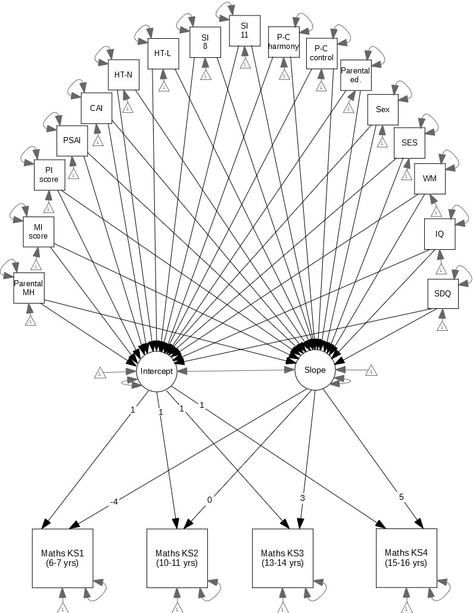
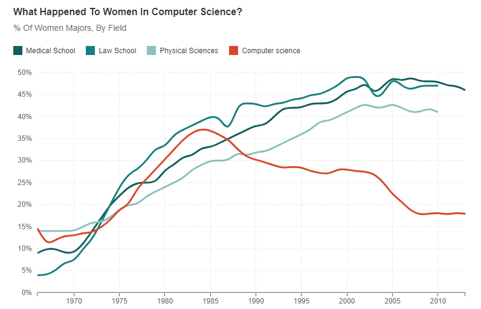

```{r, echo=FALSE, eval = F}

xaringanExtra::use_logo("../img/logo.png", width = "30px", height = "30px", link_url = "https://desupervision.netlify.app/")

```

```{r setup, include=FALSE}
library(xaringanthemer)
library(xaringanExtra)
library(tidyverse)
library(broom)
library(papaja)
library(ggcats)
library(ggimage)


options(htmltools.dir.version = FALSE)
xaringanExtra::use_panelset()


```

```{r xaringan-themer, include=FALSE, warning=FALSE}

style_mono_light(
  base_color = "#23395b"
)

```


# Session Overview

#### Part 1: Course Overview

- Introduction to fundRmentals


#### Part 2: Showcase

- The R-cult: why R is `r emo::ji("star")`*magical*`r emo::ji("star")` 


#### Part 3: Getting StaRted

- Next steps 

- Tips for success


---


class: inverse, middle, center

# Part 1: Course Overview


---


# Introduction to fundRmentals

.pull-left[

#### Course Structure

- Weekly tutorials to do in your own time 

- Weekly 'HappyHouR' practical sessions 

<br>

#### Course Aims 

- Gain solid understanding of the 'fund**R**mentals' 

  + Feel confident supervising project students using R 

  + Feel inspiRed to use R/RStudio for your own projects  

]


.pull-right[

#### FundRmentals [Webpage:](https://fundrmentals.netlify.app/)

<iframe id="inlineFrameExample"
    title="Inline Frame Example"
    height="350"
    width="500"
    src="https://fundrmentals.netlify.app/">
</iframe>

]


---


class: inverse, middle, center

# Part 2: Showcase

---


# The R-cult: why R is `r emo::ji("star")`*magical*`r emo::ji("star")` 


- Makes complicated things easy to do

- Super efficient

- Collaboration

- Reproducibility 

- Visualisations

- Modelling

- Reporting

- Presenting

- & *sooo* many other cool things!! 


---


# A *very* simple regression

- 1 line of code, much quicker than clicking in SPSS:

```{r, eval = F}

lm(outcome ~ predictor, data = data)

```

--

<br>

### *"But Dan, what if I have 10 predictors?"*

- Still just 1 line of code...

```{r, eval = F}

lm(outcome ~ predictor_1 + predictor_2 + predictor_3 + predictor_4 + predictor_5 + predictor_6 +
     predictor_7 + predictor_8 + predictor_9 + predictor_10, data = data)

```

---


# A *very* simple regression

- 1 line of code, much quicker than clicking in SPSS:

```{r, eval = F}

lm(outcome ~ predictor, data = data)

```

<br>

### *"But Dan, what if I have a factorial design?"*

- Still just 1 line of code...

```{r, eval = F}

lm(outcome ~ predictor_1*predictor_2, data = data)

```


---


# A *very* simple regression

- 1 line of code, much quicker than clicking in SPSS:

```{r, eval = F}

lm(outcome ~ predictor, data = data)

```

<br>

### *"But Dan, what if I have a stupidly complex model?"*


---


# A Gross Latent Growth [Model](../img/parmodel.jpg)

.panelset[


.panel[.panel-name[

## Model

]


```{r, echo = F, fig.align='center', out.width="28%"}



```

.center[
.teeeny[
[Evans & Field, 2020](https://royalsocietypublishing.org/doi/10.1098/rsos.200422)
]
]
]

.panel[.panel-name[

# Code

]

- Just 5 lines of code for this monstrosity: 

.teeny[

```{r, eval = F}

model <- "i =~ 1*sat140 + 1*ks2_mat + 1*ks3_mat + 1*ks4_maths
s =~ -4*sat140 + 0*ks2_mat + 3*ks3_mat + 5*ks4_maths

i ~ sex + int_sdq_11 + iq_cent + wm_cent + ses_cent + cse_voc + cse_olevel + cse_alevel + cse_degree + par_mh_fa + mum_home_int + part_home_int + cai_cent + psai_cent +
home_teach_1_al + home_teach_1_nu + schl_supp_sa + schl_supp_se + eas_harmony + eas_control

s ~ sex + int_sdq_11 + iq_cent + wm_cent + ses_cent + cse_voc + cse_olevel + cse_alevel + cse_degree + par_mh_fa + mum_home_int + part_home_int + cai_cent + psai_cent +
home_teach_1_al + home_teach_1_nu + schl_supp_sa + schl_supp_se + eas_harmony + eas_control"

growth(model, data = data, estimator = "MLR")

```

]
]
]


---


# Data Viz: A Pretty Plain Scatterplot

.center[
.middle[

```{r, echo = F, message=FALSE, warning=FALSE}

# Scatter plot
ggplot(palmerpenguins::penguins, aes(x = flipper_length_mm, y = body_mass_g)) + geom_point(colour = "black") + theme_apa() + labs(x = "Flipper Length (mm)", y = "Body Mass (g)")

```


]]


---

# Data Viz: Rainbow Box Plot

.center[
.middle[


```{r, echo = F, warning=F, message=F}


set.seed(1410)
dsmall <- diamonds[sample(nrow(diamonds), 1000), ]

p3 <- ggplot(dsmall, aes(color, price/carat, fill=color)) + geom_boxplot() + theme_apa()
p3

```


]]


---

# Data Viz: Rainbow Jitter Plot

.center[
.middle[

```{r, echo = F, warning=F, message=F}


p1 <- ggplot(dsmall, aes(color, price/carat)) + 
            geom_jitter(alpha = I(1 / 2), aes(color=color))+ theme_apa()
p1

```

]]


<!--

# Data Viz: Rainbow Circular Barchart

.center[
.middle[

```{r, message = F, echo = F, warning = F}


diamonds2plot <- diamonds %>%
  group_by(cut, color) %>%
  summarise(price = mean(price)) %>%
  arrange(color, price) %>%
  ungroup() %>%
  mutate(id = row_number(),
         angle = 90 - 360 * (id - 0.5) / n())

diamonds2plot  %>%
  ggplot(aes(factor(id), price, fill = color, group = cut, label = cut)) +
  geom_bar(stat = 'identity', position = 'dodge') +
  geom_text(hjust = 0, angle = diamonds2plot$angle, alpha = .5) +
  coord_polar() +
  ylim(-3000, 7000) +
  theme_void() 

```
]]

-->

---


# Data Viz: Mario Kart Rainbow Road 

.center[
.middle[

```{r, echo = F, message=F, warning=F}


managers_energy = read.csv("../docs/managers_energy_data.csv")
simulation = read.csv("../docs/simulation.csv")

# basic plot of empirical data
manager_plot =  ggplot() +
                geom_point( data = managers_energy, 
                aes(x = energy_pc, y = managers_employment_share)) 


# smaller point size
manager_plot = ggplot() +
                geom_point( data = managers_energy, 
                size = 0.8,
                aes(x = energy_pc, y = managers_employment_share)) 


# add log scales
manager_plot =  manager_plot +
                scale_x_log10() +
                scale_y_log10() 


# better axis breaks
manager_plot = manager_plot + 
  scale_x_log10(breaks = c(5,10,20,50,100,200,500,1000)) +
  scale_y_log10(breaks = c(0.1,0.2,0.5,1,2,5,10,20)) 


# descriptive labels
manager_plot = manager_plot +
  labs(x = "Energy use per capita (GJ)", 
       y = "Managers (% of Total Employment)" ) 


# add simulation data
manager_plot = ggplot() +
  geom_point(data = simulation, 
             size = 0.1,
             alpha = 0.3,
             aes(x = energy_pc, 
                 y = managers_employment_share, 
                 color = span_of_control)
             ) +
  geom_point(data = managers_energy, 
             size = 0.8,
             aes(x = energy_pc, 
                 y = managers_employment_share)
             ) +
  scale_x_log10(breaks = c(5,10,20,50,100,200,500,1000)) +
  scale_y_log10(breaks = c(0.1,0.2,0.5,1,2,5,10,20)) +
  labs(x = "Energy use per capita (GJ)", 
       y = "Managers (% of Total Employment)") 


# limit plot range
manager_plot = manager_plot +
  coord_cartesian(xlim = c(5,1000), ylim = c(0.1,30)) 


# descriptive color legend label 
manager_plot = manager_plot + 
  labs(color = "Span of Control")


# line break in legend label
manager_plot = manager_plot + 
  labs(color = "Span of\nControl")


# rainbow colors for span of control
manager_plot = manager_plot +
  scale_color_gradientn(colours = rainbow(8))


# reverse color legend
manager_plot = manager_plot +
  scale_color_gradientn(colours = rainbow(8), 
                        guide = guide_colourbar(reverse = T))


# black and white theme
manager_plot = manager_plot + theme_bw()


# change font to Times
manager_plot = manager_plot + 
  theme(text=element_text(size = 10, family="Times"))


# all code
manager_plot = ggplot() +
  geom_point(data = simulation, 
             size = 0.1,
             alpha = 0.3,
             aes(x = energy_pc, 
                 y = managers_employment_share, 
                 color = span_of_control)
  ) +
  geom_point(data = managers_energy, 
             size = 0.8,
             aes(x = energy_pc, 
                 y = managers_employment_share)
  ) +
  scale_x_log10(breaks = c(5,10,20,50,100,200,500,1000)) +
  scale_y_log10(breaks = c(0.1,0.2,0.5,1,2,5,10,20)) +
  labs(x = "Energy use per capita (GJ)", 
       y =  "Managers (% of Total Employment)",
       color = "Span of \nControl") +
  coord_cartesian(xlim = c(5,1000), ylim = c(0.1,30)) +
  scale_color_gradientn(colours = rainbow(8), 
                        guide=guide_colourbar(reverse = T) ) +
  theme_bw() +
  theme(text=element_text(size = 10, family="Times"))


# all code with custom theme
manager_plot = ggplot() +
  geom_point(data = simulation, 
             size = 0.1,
             alpha = 0.3,
             aes(x = energy_pc, 
                 y = managers_employment_share, 
                 color = span_of_control)
  ) +
  geom_point(data = managers_energy, 
             size = 0.8,
             aes(x = energy_pc, 
                 y = managers_employment_share)
  ) +
  scale_x_log10(breaks = c(5,10,20,50,100,200,500,1000)) +
  scale_y_log10(breaks = c(0.1,0.2,0.5,1,2,5,10,20)) +
  labs(x = "Shells Thrown", 
       y =  "Laps",
       color = "Lane") +
  coord_cartesian(xlim = c(5,1000), ylim = c(0.1,30)) +
  scale_color_gradientn(colours = rainbow(8), 
                        guide=guide_colourbar(reverse = T) ) +
  theme_bw() +
  theme(panel.grid.major = element_blank(), 
      panel.grid.minor = element_blank(), 
      plot.title = element_text(face="bold", size = rel(1), hjust = 0.5),
      axis.line = element_line(color = "black"), 
      axis.title.x = element_text(vjust= 0, size=rel(0.9)),
      axis.title.y = element_text(vjust= 1.1, size=rel(0.9)),
      axis.text.x = element_text(margin=margin(5,5,0,0,"pt")),
      axis.text.y = element_text(margin=margin(3,5,0,3,"pt")),
      axis.ticks.length = unit(-0.7, "mm"),
      text=element_text(size = 10, family="Times")) 


manager_plot + theme_apa()


```


]]


---


# Data Viz: sCATterplot

.center[
.middle[

```{r, echo = F, message=FALSE, warning=FALSE}

# Scatter plot
ggplot(iris, aes(Petal.Length, Petal.Width)) +
 geom_cat(cat = "lil_bub", size = 2) +theme_apa() + labs(x = "Catnip Consumed", y = "Happiness")

```


]]


---


# Data Viz: Dan<sup>2</sup>


.center[
.middle[


```{r, echo = F, warning=F, message=F}

d <- data.frame(x = iris$Sepal.Length,
                y = iris$Sepal.Width,
                image = "../img/mem.png"
                ) %>% sample_n(., 90)

ggplot(d, aes(x, y)) + geom_image(aes(image=image), size=.1) + theme_apa() + labs(x = "Dan", y = "Dan")


```

]]


---


# RMarkdown

.pull-left[

- Combine code (analyses, plots etc.) & write-up in one document 

- Create a nicely formatted word doc/html/pdf & more

- Super useful for writing papers, dissertations & theses

- Additional packages (`papaja` & `rticles`) for apa style/journal formatting


]

.pull-right[

```{r paper, echo=FALSE, out.width = '70%', fig.align='center'}
knitr::include_graphics("../img/papajagif.gif")
```

]


---

# Inline Code

- Allows you to include code within the main text of your document 

- Can be used with test results, values from tables etc.

- Any values will be automatically updated when you render the file 

- Incredibly useful & efficient

- Helps you avoid tYpos & rounding erroRs

<br>

.center[

**The final sample consisted of `` `r knitr::inline_expr("nrow(data)")` `` participants.**


```{r, echo = F, fig.align='center', out.width="5%"}

knitr::include_graphics("../img/down2.png")

```


**The final sample consisted of 500 participants.**


]


<!--

# SisteRs are doin' it for themselves (*& others*)

.pull-left[

- Widening gender gap in coding skills ([npr, 2014](https://www.npr.org/sections/money/2014/10/21/357629765/when-women-stopped-coding); [OECD, 2015](https://www.oecd-ilibrary.org/education/the-abc-of-gender-equality-in-education_9789264229945-en))

- Psychology @ Sussex is predominantly made up of female students & is an entry into STEM fields where girls are underrepresented 

- By learning how to code ourselves, we can help reduce the skills gender gap by being role models/supporting students' learning 
]


.pull-right[

<a href="https://www.npr.org/sections/money/2014/10/21/357629765/when-women-stopped-coding">

```{r, echo = F}



```

</a>

]

-->

---


class: center, middle

# You can create beautiful [slides](https://github.com/yihui/xaringan) like these... 


```{r, echo = F}


```


---


class: center, middle

# You can create super cool [websites...](https://rstudio.github.io/distill/) `r emo::ji("wink")`


<iframe id="inlineFrameExample"
    title="Inline Frame Example"
    height="350"
    width="1000"
    src="https://fundrmentals.netlify.app/">
</iframe>


---

class: inverse, middle, center

# Part 3: Getting StaRted


---

# Next Steps

#### Complete the [tutorial](http://milton-the-cat.rocks/learnr/r/r_getting_started/) before our first HappyHouR next week, which covers: 

  + How to install R & RStudio (see the [Week 01 webpage](https://fundrmentals.netlify.app/week_01.html) for download links to the software)
  + A tour of RStudio
  + Working in RStudio
  + Installing & loading packages
  + RMarkdown


#### Tips for Success

  + Practice as often as you can
  + Be kind to yourself - it feels really slow & confusing when you first start
  + Celebrate the little wins
  + Ask lots of questions, often someone else explaining it slightly different makes everything click
  + There's a huge online community of R users, for any problems/errors you're having the solution can usually be found quite easily by searching
  + Google is your best friend 


