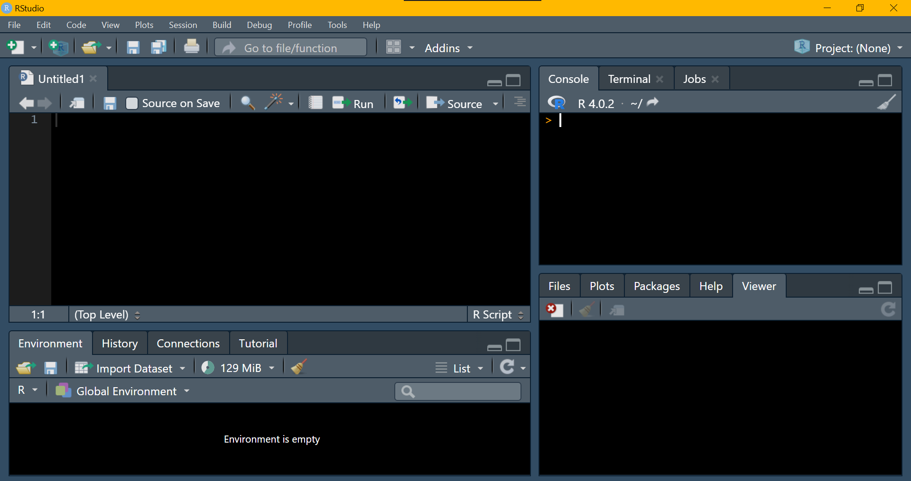

```{r, echo=FALSE, eval = F}

xaringanExtra::use_logo("../img/logo.png", width = "30px", height = "30px", link_url = "https://fundrmentals.netlify.app/")

```

```{r setup, include=FALSE}
library(xaringanthemer)
library(xaringanExtra)
library(tidyverse)
library(broom)
library(papaja)
library(ggcats)
library(ggimage)


options(htmltools.dir.version = FALSE)
xaringanExtra::use_panelset()

data <- palmerpenguins::penguins

```

```{r xaringan-themer, include=FALSE, warning=FALSE}

style_mono_light(
  base_color = "#23395b"
)

```


# Session Overview

#### Part 1: Course Overview

- What even is R & why are you making me learn it?

- Introduction to the fundRmentals course

- The R-cult: why R is `r emo::ji("star")`*magical*`r emo::ji("star")` 


#### Part 2: Getting StaRted

- Tips for success

- Next steps 

- Installing R & RStudio


---


class: middle, center

# Part 1: Course Overview


---

# What even is R anyway? `r emo::ji("thinking_face")`

.pull-left[

- R is a programming language where we can talk to our computer & tell it what to do...

```{r}

print("Hi LearneRs!")

```


]

.pull-right[

- RStudio is a more user-friendly interface where we can use R


```{r, echo = F}



```


]


---


# Introduction to fundRmentals

.pull-left[

#### Course Structure

- Weekly tutorials to do in your own time 

- Weekly 'HappyHouR' practical sessions 

<br>

#### Course Aims 

- Gain solid understanding of the 'fundRmentals' 

  + Feel confident supervising project students using R 

  + Feel inspired to use R/RStudio for your own projects  

]


.pull-right[

#### FundRmentals [Webpage:](https://fundrmentals.netlify.app/)

<iframe id="inlineFrameExample"
    title="Inline Frame Example"
    height="350"
    width="500"
    src="https://fundrmentals.netlify.app/">
</iframe>

]


---


# The R-cult: why R is `r emo::ji("star")`*magical*`r emo::ji("star")` 


- Makes complicated things easy to do

- Super efficient

- Collaboration

- Reproducibility 

- Visualisations

- Modelling

- Reporting

- Presenting

- & *sooo* many other cool things!! 


---


# A *very* simple regression

- 1 line of code, much quicker than clicking in SPSS:

```{r, eval = F}

lm(outcome ~ predictor, data = data)

```

--

<br>

### *"But Dan, what if I have 10 predictors?"*

- Still just 1 line of code...

```{r, eval = F}

lm(outcome ~ predictor_1 + predictor_2 + predictor_3 + predictor_4 + predictor_5 + predictor_6 +
     predictor_7 + predictor_8 + predictor_9 + predictor_10, data = data)

```


---

# A *very* simple regression

- 1 line of code, much quicker than clicking in SPSS:

```{r, eval = F}

lm(outcome ~ predictor, data = data)

```

<br>

### *"But Dan, what if I want to do a t-test?"*

```{r, eval = F}

t.test(outcome ~ grouping_variable, data = data)

```

### *"Or a correlation?"*

```{r, eval = F}

cor.test(~ variable_1 + variable_2, data = data)

```

---


# A *very* simple regression

- 1 line of code, much quicker than clicking in SPSS:

```{r, eval = F}

lm(outcome ~ predictor, data = data)

```

<br>

### *"But Dan, what if I have a factorial design?"*

- Still just 1 line of code...

```{r, eval = F}

lm(outcome ~ predictor_1*predictor_2, data = data)

```


---


# A *very* simple regression

- 1 line of code, much quicker than clicking in SPSS:

```{r, eval = F}

lm(outcome ~ predictor, data = data)

```

<br>

### *"But Dan, what if I have a stupidly complex model?"*


---


# A Gross Latent Growth [Model](../img/parmodel.jpg)

.panelset[


.panel[.panel-name[

## Model

]


```{r, echo = F, fig.align='center', out.width="28%"}

knitr::include_graphics("../img/parmodel.jpg")

```

.center[
.teeeny[
[Evans & Field, 2020](https://royalsocietypublishing.org/doi/10.1098/rsos.200422)
]
]
]

.panel[.panel-name[

# Code

]

- Just 5 lines of code for this monstrosity: 

.teeny[

```{r, eval = F}

model <- "i =~ 1*sat140 + 1*ks2_mat + 1*ks3_mat + 1*ks4_maths
s =~ -4*sat140 + 0*ks2_mat + 3*ks3_mat + 5*ks4_maths

i ~ sex + int_sdq_11 + iq_cent + wm_cent + ses_cent + cse_voc + cse_olevel + cse_alevel + cse_degree + par_mh_fa + mum_home_int + part_home_int + cai_cent + psai_cent +
home_teach_1_al + home_teach_1_nu + schl_supp_sa + schl_supp_se + eas_harmony + eas_control

s ~ sex + int_sdq_11 + iq_cent + wm_cent + ses_cent + cse_voc + cse_olevel + cse_alevel + cse_degree + par_mh_fa + mum_home_int + part_home_int + cai_cent + psai_cent +
home_teach_1_al + home_teach_1_nu + schl_supp_sa + schl_supp_se + eas_harmony + eas_control"

growth(model, data = data, estimator = "MLR")

```

]
]
]


---
# Data Viz: A Pretty, Plain, APA Scatterplot


.pull-left[
.tiny[

```{r, echo = T, message=FALSE, warning=FALSE, eval=F}

ggplot(data, aes(x = flipper_length_mm, y = body_mass_g)) +
  geom_point() + 
    labs(x = "Flipper Length (mm)", y = "Body Mass (g)") + 
      theme_apa() 
  
```
]
]

.pull-right[

```{r, echo = F, message=FALSE, warning=FALSE, eval=T, out.width="85%"}

ggplot(data, aes(x = flipper_length_mm, y = body_mass_g)) + 
  geom_point() + 
    labs(x = "Flipper Length (mm)", y = "Body Mass (g)") + 
      theme_apa() 
  
```


]


---
# Data Viz: Grouped Scatterplot


.pull-left[
.teeny[

```{r, echo = T, message=FALSE, warning=FALSE, eval=F}

ggplot(data, aes(x = flipper_length_mm, y = body_mass_g, colour = island)) +
  geom_point() + 
    labs(x = "Flipper Length (mm)", y = "Body Mass (g)", colour = "Island") + 
      theme_apa() 
  
```
]
]

.pull-right[

```{r, echo = F, message=FALSE, warning=FALSE, eval=T, out.width="85%"}

ggplot(data, aes(x = flipper_length_mm, y = body_mass_g, colour = island)) +
  geom_point() + 
    labs(x = "Flipper Length (mm)", y = "Body Mass (g)", colour = "Island") + 
      theme_apa() 
  
```

]

---


# Data Viz: sCATterplot

.pull-left[
.tiny[

```{r, echo = T, message=FALSE, warning=FALSE, eval = F}

ggplot(data, aes(x = flipper_length_mm, y = body_mass_g)) +
 geom_cat(cat = "lil_bub", size = 2) + 
  labs(x = "Catnip Consumed", y = "Happiness") + 
    theme_apa()

```

]]

.pull-right[

```{r, echo = F, message=FALSE, warning=FALSE, out.width="85%"}

ggplot(data, aes(x = flipper_length_mm, y = body_mass_g)) + 
 geom_cat(cat = "lil_bub", size = 2) + 
  labs(x = "Catnip Consumed", y = "Happiness") + 
    theme_apa()

```


]


---


# RMarkdown

.pull-left[

- Combine code (analyses, plots etc.) & text in one document 

- Great for writing notes about your analyses or for creating nicely formatted word docs/htmls/pdfs etc.

- Super useful for writing journal articles, dissertations & theses

- Additional packages (`papaja` & `rticles`) for apa style/journal formatting

- **Most (if not _all_) students will use RMarkdown for their analyses**


]

.pull-right[

```{r paper, echo=FALSE, out.width = '70%', fig.align='center'}
knitr::include_graphics("../img/papajagif.gif")
```

]


---

# Inline Code

- Allows you to include code within the main text of your document 

- Can be used with test results, values from tables etc.

- Any values will be automatically updated when you render the file 

- Incredibly useful & efficient

- Helps you avoid tYpos & rounding erroRs

<br>

.center[

**The final sample consisted of `` `r knitr::inline_expr("nrow(data)")` `` participants.**


```{r, echo = F, fig.align='center', out.width="5%"}

knitr::include_graphics("../img/down2.png")

```


**The final sample consisted of 500 participants.**


]


---


class: center, middle

# You can create beautiful [slides](https://github.com/yihui/xaringan) like these... 


```{r, echo = F}


```


---


class: center, middle

# You can create super cool [websites...](https://rstudio.github.io/distill/) `r emo::ji("wink")`


<iframe id="inlineFrameExample"
    title="Inline Frame Example"
    height="350"
    width="1000"
    src="https://fundrmentals.netlify.app/">
</iframe>


---

class: middle, center

# Part 2: Getting StaRted


---

# Tips for Success

#### For Supervision...

Number 1 rule: don't panic! We've all got this!!

- Students have access to everything we've covered thus far on Canvas 
- They are equipped to be able to do their analyses - they just don't know it 
- They'll also have access to an R helpdesk next semester & two analyses workshops 


#### For Yourself...

- Practice as often as you can
- Be kind to yourself - it feels really slow & confusing when you first start
- Ask questions, often someone else explaining it slightly differently makes everything click
- There's a huge online community of R users, for any problems/errors you're having the solution can usually be found quite easily by searching
- Google is your best friend 


---

# Next Steps

#### Complete the [tutorial](http://milton-the-cat.rocks/learnr/r/r_getting_started/) before our first .orange[HappyHouR] next week, which covers: 

- Installation & tour of RStudio

- Working in RStudio

- Installing & loading packages

- RMarkdown

- Getting data into RStudio

- Tables in RMarkdown


---

class: center, middle

# Installing R & RStudio Walkthrough


