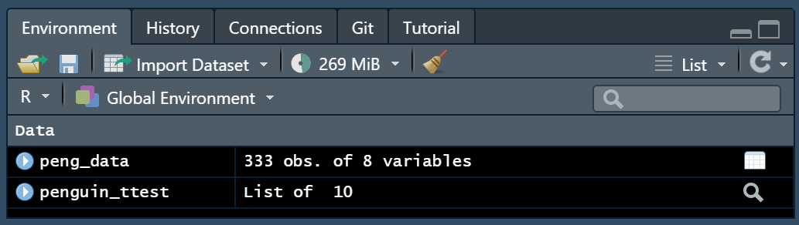
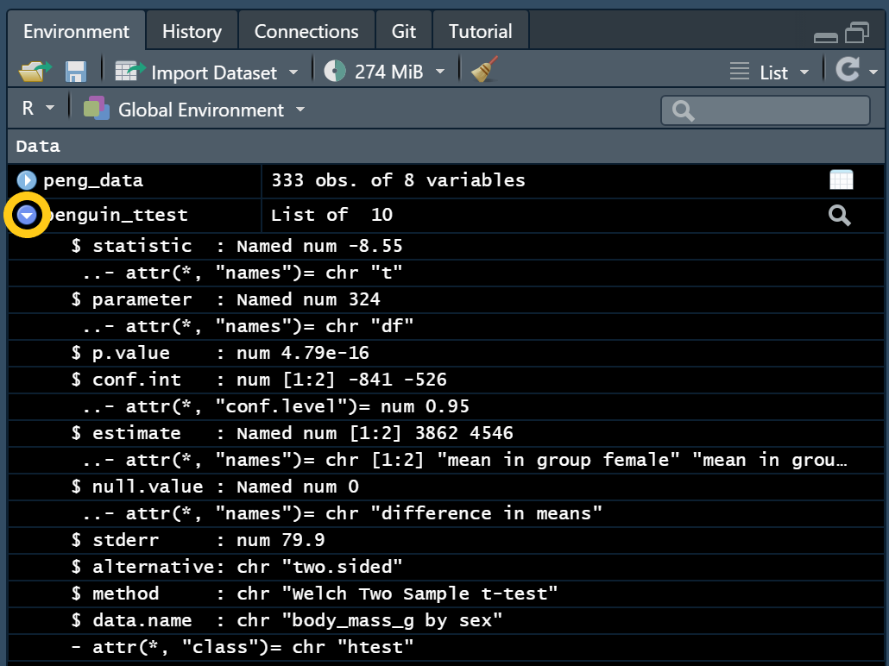
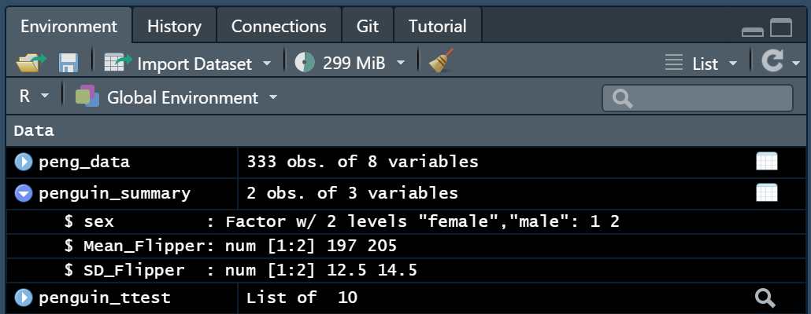

```{r setup, include=FALSE}
knitr::opts_chunk$set(echo = FALSE)
library(xaringanExtra)
library(emo)
```

### What is it?

The output of code can be included within the body of an RMarkdown document (i.e., 'inline') to increase accuracy and efficiency when reporting values/results. The output of the inline code will be entirely indistinguishable from the surrounding text in the document, as though you had written it manually. Inline code is used by enclosing objects or functions inside a set of back ticks within an RMarkdown file like this:


<center>

`` `r knitr::inline_expr("function_goes_here()")` ``

`` `r knitr::inline_expr("object_name_goes_here")` ``

</center>

By using inline code, we can avoid any typos when reporting results and it also means that if our data, results, or tables change in any way, the RMarkdown file will be updated with the new values automatically whenever we knit the document. 


### How do I use it?

We can use inline code to pull out information from a range of sources including the dataset itself, tables, test results, other objects we have created, or from the output of functions. An overview of the most common sources & examples of the inline code we can use are given below. 


#### Sample size

We can find out the sample size of our data by using the `nrow()` function on a dataset, or by using the `length()` function on a vector. So to report the sample size in our RMarkdown document, we could write something like the below, where we give the name of our **data** in the brackets:

<center>

`` `r knitr::inline_expr("nrow(data)")` ``

</center>

We'll typically include this line in a sentence within a method section, such as:

<center>

The sample consisted of `` `r knitr::inline_expr("nrow(data)")` `` participants. 

</center>

Then when we knit our RMarkdown document, the sample size will be automatically printed in place of our inline code in the knitted file. If our data were to change in any way (i.e., from excluding participants), then our sample size would be automatically updated the next time we knitted this document, if we wrote it in this way. 


#### Test results, other objects, & tables

We can also report the results of statistical tests or pull out values from other objects in a relatively straightforward way. 

Whenever we run code that creates an object in RStudio it will appear in our **Environment pane**. Objects contain elements with different names, and those elements can also contain multiple pieces of information. But we can use the environment pane to find out the names of the elements in an object to work out how we can write code that accesses the pieces of information that we want. 

For example, if we were to run a *t*-test on some penguin data (**peng_data**) and saved the test result in an object called **penguin_ttest**, our environment pane would look something like this:


```{r, echo = F, fig.align='center'}

```

We can use the blue '**play button**' on the left side of our object name to see the elements it contains:

```{r, echo = F, fig.align='center'}

```

From this, we can see that we have 10 elements, the names of each of them are given next to the **$** such as *statistic*, *parameter*, *p.value*, *conf.int* and so on. We can also see that some of these elements also have more than one value associated with it, for example, for the *conf.int* element, the square brackets next to it tell us there are two values in this element, and we can access both or just one of them if we wanted to. 

So now we know where to find the names of the different elements in an object, the next part is to actually write some code to select them! We can do this using the **$** to select an element in our object, and by using a set of **[ ]** to select one of multiple possible values where this is applicable. 

So if we wanted to report the *p.value* from this **penguin_ttest** object using inline code, we could write the below: 

<center>

`` `r knitr::inline_expr("penguin_ttest$p.value")` ``

</center>

If we wanted to report our estimates separately, we can follow the same steps as above, but this time we need to add the **[ ]** and the number that corresponds to the item we want to print out, so the below would print out the first value of the estimate element:

<center>

`` `r knitr::inline_expr("penguin_ttest$estimate[1]")` ``

</center>

And this would print out the second value:

<center>

`` `r knitr::inline_expr("penguin_ttest$estimate[2]")` ``

</center>

This method also works for any tables we have created. 

```{r, echo = F, fig.align='center'}

```

Where we could use the following line to pull out the mean flipper length for female penguins in our table:

<center>

`` `r knitr::inline_expr("penguin_summary$Mean_Flipper[1]")` ``

</center>

### Tips

- You must include the `r` inside the back ticks for the code to be evaluated - this is something easily forgotten. 

- We can check if our inline code is correct without knitting the document by placing the cursor inside the brackets, or directly next to the line of code and pressing `ctrl + enter` or `command + enter` to run it. If the code works, the result will be printed in the console and will appear in the .Rmd as a pop-up. 

- We can format our values further by using the `round()` function i.e.,

<center>

`` `r knitr::inline_expr("penguin_ttest$estimate[1] %>% round(digits = 2)")` ``

</center>


<br>

### & that's all there is to it!! `r emo::ji("grinning")`

<br>

